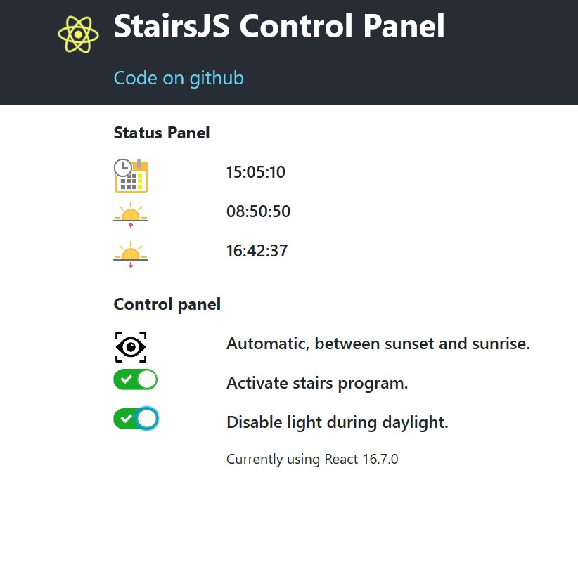

# stairsJs-control-panel
It is a front-end (GUI client) for the automatic led-light server program of my stairs, which can be found here: https://github.com/Vinz68/stairsJs.
The server program (stairsJs repository) controls the led-strips on the stairs automatically
based on the current sunset and sunrise times and using 2 passive infra red (PIR) sensors to detect the people who want to go up or down.

This client program (stairsJs-control-panel) gives the status and control of this stairs program.
Status: Current time, Sunrise time, Sunset time and the current state/mode and 2 settings.
Control: There program has different modes which can be set:
| Mode                             | Description                                      | 
|:--------------------------------:| ------------------------------------------------:|
| 'Always off.' | Stairs Lights always turned off |
| 'Automatic, by PIR.' | When PIR detects a person, turn on stair lights. |          
| 'Automatic, by PIR when dark.' | When Dark and PIR detects a person, turn on lights.|
| 'Always on.' | Stairs Lights always turned on |
| 'Always on when dark.' | When Dark, Stairs Lights always turned on|
|  'Test1 activated.' | Test mode, for future usage. |
|:--------------------------------:| ------------------------------------------------:|
 

## Screenshot
 

This project was bootstrapped with [Create React App](https://github.com/facebook/create-react-app)

## Available Scripts

In the project directory, you can run:

### `npm start`

Runs the app in the development mode. 
Open [http://localhost:3000](http://localhost:3000) to view it in the browser.

The page will reload if you make edits. 
You will also see any lint errors in the console.

### `npm test`

Launches the test runner in the interactive watch mode. 
See the section about [running tests](https://facebook.github.io/create-react-app/docs/running-tests) for more information.

### `npm run build`

Builds the app for production to the `build` folder. 
It correctly bundles React in production mode and optimizes the build for the best performance.

The build is minified and the filenames include the hashes. 
Your app is ready to be deployed!

See the section about [deployment](https://facebook.github.io/create-react-app/docs/deployment) for more information.

## Learn More

You can learn more in the [Create React App documentation](https://facebook.github.io/create-react-app/docs/getting-started).

To learn React, check out the [React documentation](https://reactjs.org/).

